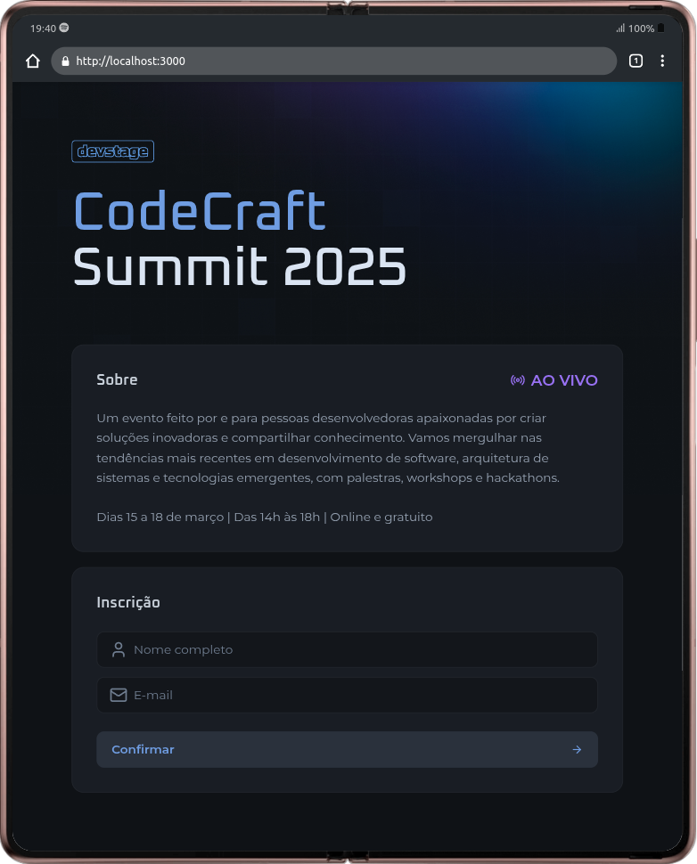
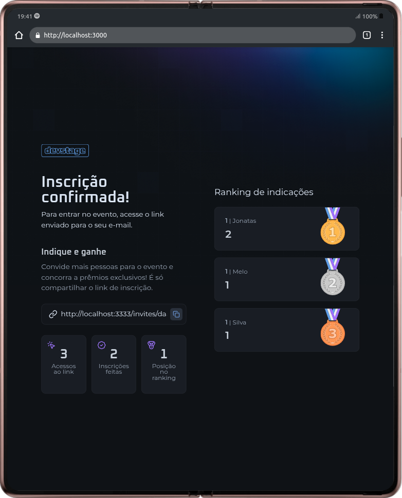
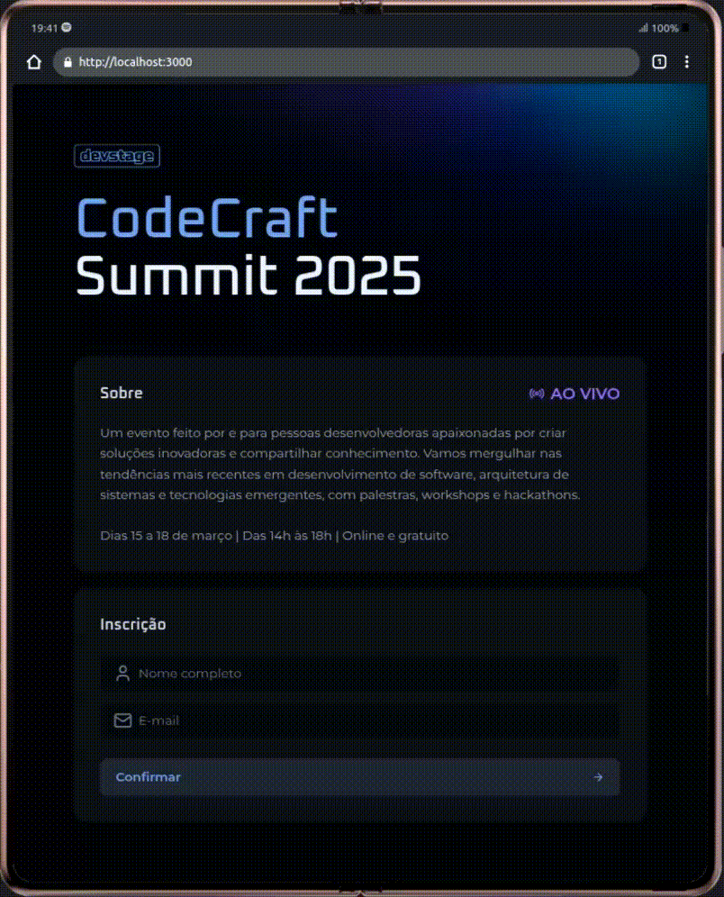

# 🚀 NLW Connect Web - Rocketseat

**Projeto construído durante o NLW Connect** - Um evento intensivo de 3 dias que elevou minhas skills frontend a outro nível! 💜

[](https://react.dev)
[](https://nextjs.org)
[](https://www.typescriptlang.org)

## 📸 Screenshots/GIFs

<div align="center">
  
  
  
</div>

## 🗺️ Roadmap

Estes são os próximos passos planejados para o projeto:

- **✅ Testes automatizados**  
  Adicionar testes unitários com **Vite** e testes E2E com **Cypress** para garantir a qualidade do código.

- **🔐 Autenticação social**  
  Implementar login com **Google** e **GitHub** usando NextAuth.js ou Clerk.

- **🚀 Deploy contínuo**  
  Configurar CI/CD para deploy automático na **Vercel** ou **Netlify**.

- **🌓 Dark/Light Mode**  
  Adicionar suporte a temas escuro e claro, com persistência de preferência do usuário.

- **📱 Responsividade aprimorada**  
  Melhorar a experiência em dispositivos móveis.

Quer contribuir com alguma dessas features? [Abra uma issue](https://github.com/jonatas-melo-silva/nlw-connect-web/issues) ou envie um PR! 🚀

## ✨ Features

- ✅ Componentes acessíveis e altamente reutilizáveis
- ✅ Validação de formulários com Zod + React Hook Form
- ✅ Estilização eficiente com Tailwind CSS
- ✅ Linting ultra-rápido usando Biome (2x mais rápido que ESLint!)
- ✅ Arquitetura organizada e escalável
- ✅ Integração com Radix UI para componentes primitivos

## 🛠️ Tecnologias

### Core Stack

- **Next.js 15** (App Router)
- **React 19** (Canary)
- **TypeScript 5**
- **Tailwind CSS** + Tailwind Merge

### Ferramentas-chave

- **Zod**: Validação type-safe
- **React Hook Form**: Gerenciamento de formulários
- **Radix UI**: Componentes acessíveis
- **Lucide React**: Ícones modernos
- **Class Variance Authority**: Variants em componentes

### Dev Tools

- **Biome**: Formatação e linting relâmpago ⚡
- **Orval**: Geração automática de clients API
- **PostCSS**: Processamento CSS moderno

## 🚀 Começando

### Pré-requisitos

- Node.js 18+
- npm 9+

### Instalação

```bash
# Clone o repositório
git clone https://github.com/jonatas-melo-silva/nlw-connect-web.git

# Instale as dependências
npm install

# Configure as variáveis de ambiente (se necessário)
cp .env.example .env.local
```

## ▶️ Executando

```bash
# Modo desenvolvimento
npm run dev

# Build de produção
npm run build

# Formatação e linting
npm run write
npm run check
```

## 🤝 Contribuindo

Contribuições são sempre bem-vindas! Para contribuir:

1. Faça um fork do repositório.

2. Crie uma branch para sua feature ou correção:

    ```bash
    git checkout -b minha-feature
    ```

3. Commit suas alterações:

    ```bash
    git commit -m "Adicionei uma nova feature"
    ```

4. Faça um push para a branch:

    ```bash
    git push origin minha-feature
    ```

5. Abra um Pull Request no repositório original.

Siga as melhores práticas para garantir que suas alterações sejam revisadas e aceitas rapidamente.

## 📄 Licença

Este projeto está sob a licença MIT - veja o arquivo [LICENSE](LICENSE) para detalhes.

---

Feito com 💜 por [Jonatas Melo Silva](https://github.com/jonatas-melo-silva) durante o NLW Connect da Rocketseat.  

**Dica profissional:** ⭐️ Deixe sua estrela no repositório se gostou do projeto!
